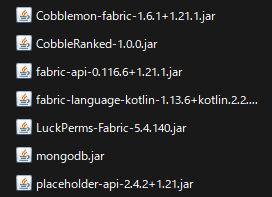
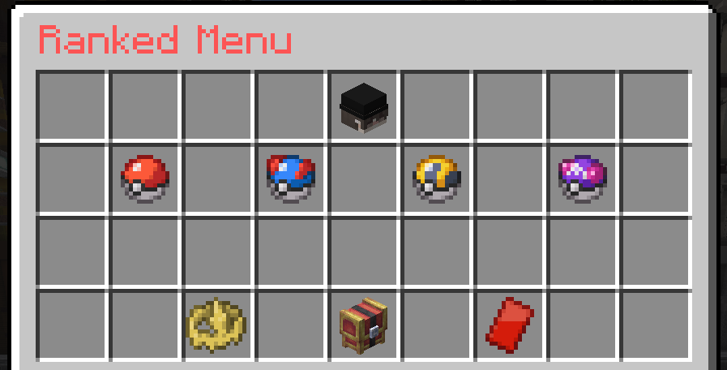
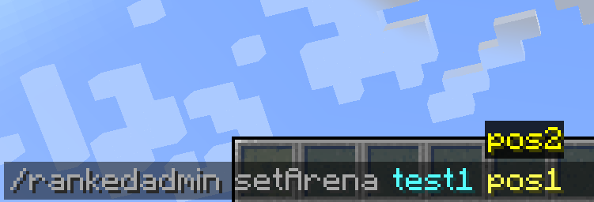
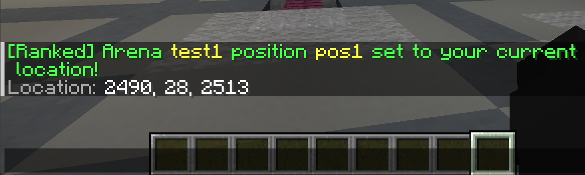

# Installation Guide

Complete guide to install CobbleRanked on your Minecraft server.

---

## Required Mods

Place all of these in your `mods` folder:

| Mod | Version | Download |
|-----|---------|----------|
| Fabric Loader | 0.17.2+ | [fabricmc.net](https://fabricmc.net/use/server/) |
| Fabric API | 0.116.6+ | [CurseForge](https://www.curseforge.com/minecraft/mc-mods/fabric-api) |
| Cobblemon | 1.7.0+ | [Modrinth](https://modrinth.com/mod/cobblemon) |
| Fabric Language Kotlin | 1.13.6+ | [CurseForge](https://www.curseforge.com/minecraft/mc-mods/fabric-language-kotlin) |
| **CobbleRanked** | Latest | [Discord](https://discord.gg/VVVvBTqqyP) |

**Target:** Minecraft 1.21.1 (Fabric server)



---

## Installation Steps

### 1. Place Mods
Copy all JARs to `server/mods/` folder

### 2. Start Server
On first launch, config files auto-generate:

```
server/
├── config/
│   └── cobbleranked/
│       ├── config.json5        ← Main config
│       ├── blacklist.json5     ← Pokemon/move restrictions
│       ├── arenas.json5        ← Battle coordinates
│       ├── rewards.json5       ← Season/milestone rewards
│       ├── ranked.db           ← SQLite database
│       ├── gui/                ← 4 language GUIs
│       └── language/           ← 4 language files
```

### 3. Verify Installation

**Console output:**
```
[CobbleRanked] Mod initialized successfully
[CobbleRanked] Configuration loaded
[CobbleRanked] Database initialized (SQLite)
[CobbleRanked] Season manager initialized
```

**In-game test:**
```
/ranked
```
If GUI opens → Installation successful! ✅



---

## Initial Setup (Optional)

<details>
<summary><strong>Language Configuration</strong></summary>

Default: English (`en-Us`)

Edit `config/cobbleranked/config.json5`:

```json5
{
  "language": "ja-Jp"  // en-Us | ja-Jp | fr-Fr
}
```

**Reload:** `/rankedadmin reload`

**Affects:** GUI text, messages, validation errors

</details>

### Arena Setup (Recommended)

Teleport players to battle coordinates when battles start.

**Step 1:** Stand at the position where you want players to teleport **when the battle starts**
**Step 2:** Run command for each spawn position:

```bash
# For SINGLES, DOUBLES, TRIPLES (2 positions needed)
/rankedadmin setArena main_arena pos1
# Move to second spawn point, then:
/rankedadmin setArena main_arena pos2

# For MULTI mode (4 positions needed - 2 teams of 2)
/rankedadmin setArena multi_arena pos1
/rankedadmin setArena multi_arena pos2
/rankedadmin setArena multi_arena pos3
/rankedadmin setArena multi_arena pos4
```

**Saved:** Position (x, y, z), facing (yaw, pitch), dimension

**Command execution:**


**Command output:**


<details>
<summary><strong>Multiple Arenas (Optional)</strong></summary>

Create multiple battle locations for variety:

```
/rankedadmin arena set arena_volcano
/rankedadmin arena set arena_ocean
/rankedadmin arena set arena_forest
```

**Random selection:** Automatically rotates between arenas

**Manage arenas:**
```
/rankedadmin arena list          # View all
/rankedadmin arena tp <name>     # Teleport to arena
/rankedadmin arena remove <name> # Delete arena
```

</details>

### Basic Rules (Recommended)

Ban legendaries and OHKO moves:

Edit `config/cobbleranked/blacklist.json5`:

```json5
{
  "black_list_labels": ["legendary", "mythical"],
  "black_list_moves": ["fissure", "sheer_cold", "horn_drill", "guillotine"]
}
```

**Reload:** `/rankedadmin reload`

**Details:** [Blacklist Configuration](../configuration/blacklist.md)

---

## Cross-Server Setup (Advanced)

**Required for:** Multi-server networks sharing rankings

**Architecture:**


### Requirements

- MySQL 8.0+ OR MongoDB 6.0+ (choose one)
- Redis 6.0+
- Velocity 3.4.0+

### Quick Setup

**1. Choose Database:**
- MySQL: Traditional, good for 2-5 servers
- MongoDB: Cloud-ready (Atlas), better for 5+ servers

**2. Install Redis:**

<details>
<summary><strong>Ubuntu/Debian/Linux</strong></summary>

```bash
sudo apt install redis-server
sudo systemctl start redis-server
sudo systemctl enable redis-server
```

</details>

<details>
<summary><strong>Windows</strong></summary>

**Option 1: Using WSL2 (Recommended)**
```bash
# Install WSL2 first (if not already installed)
wsl --install

# Inside WSL2:
sudo apt update
sudo apt install redis-server
sudo service redis-server start
```

**Option 2: Using Memurai (Redis-compatible)**
1. Download Memurai from [https://www.memurai.com/](https://www.memurai.com/)
2. Run the installer
3. Start Memurai service from Windows Services

**Option 3: Using Docker Desktop**
```bash
docker run -d -p 6379:6379 --name redis redis:latest
```

**Test Connection:**
```bash
# Using redis-cli (if available)
redis-cli ping
# Should return: PONG

# Or use telnet
telnet localhost 6379
# Then type: PING
```

</details>

**3. Configure Servers:**

<details>
<summary><strong>Battle Server Configuration</strong></summary>

Edit `config/cobbleranked/config.json5`:

```json5
{
  "cross_server": {
    "enabled": true,
    "server_id": "battle",
    "battle_server": "",  // Empty = this IS battle server
    "database": {
      "type": "MYSQL",  // or MONGODB
      "host": "localhost",
      "port": 3306,
      "database": "cobbleranked",
      "username": "cobbleranked",
      "password": "your_password"
    },
    "redis": {
      "host": "localhost",
      "port": 6379,
      "password": "",
      "database": 0
    }
  }
}
```

</details>

<details>
<summary><strong>Lobby Server Configuration</strong></summary>

Edit `config/cobbleranked/config.json5`:

```json5
{
  "cross_server": {
    "enabled": true,
    "server_id": "lobby1",     // Unique per server!
    "battle_server": "battle",  // Must match Velocity server name
    "database": { /* SAME as battle */ },
    "redis": { /* SAME as battle */ }
  }
}
```

</details>

**Full Guide:** [Cross-Server Setup](../advanced/cross-server.md)

---

## See Also

- [FAQ & Troubleshooting](../support/faq.md) - Common issues and solutions

---

## File Structure Reference

```
config/cobbleranked/
├── config.json5           # Main settings (seasons, Elo, clauses)
├── blacklist.json5        # Restrictions (Pokemon/moves/abilities/items)
├── arenas.json5           # Battle coordinates
├── rewards.json5          # Season-end & milestone rewards
├── ranked.db              # SQLite database (auto-created)
├── gui/
│   ├── gui-enUs.json5     # English interface
│   ├── gui-jaJp.json5     # Japanese interface
│   └── gui-frFr.json5     # French interface
└── language/
    ├── en-Us.json5        # English messages
    ├── ja-Jp.json5        # Japanese messages
    └── fr-Fr.json5        # French messages
```

**All files use JSON5 format** (allows comments `//`)

<details>
<summary><strong>What is JSON5?</strong></summary>

JSON5 is a more human-friendly variant of JSON that allows:

- **Comments:** Use `//` for single-line or `/* */` for multi-line comments
- **Trailing commas:** Last item in arrays/objects can have a comma
- **Unquoted keys:** Object keys don't need quotes (in most cases)

**Example:**
```json5
{
  // This is a comment
  "language": "en-Us",  // Trailing comma is OK
  max_players: 100      // Unquoted key works
}
```

**Validation:** Use [https://json5.org/](https://json5.org/) to validate syntax

**More info:** See [FAQ](../support/faq.md#json5-configuration)

</details>

---

## Next Steps

### For Casual Servers
1. **[Set arenas](../configuration/arenas.md)** - Battle locations
2. **[Configure rewards](../configuration/rewards.md)** - Top 3 prizes
3. **[Customize GUI](../configuration/gui.md)** - Interface tweaks

### For Competitive Servers
1. **[Configure blacklist](../configuration/blacklist.md)** - Smogon/VGC rules
2. **[Adjust Elo system](../configuration/config.md#elo-system)** - Fine-tune ratings
3. **[Set level scaling](../configuration/config.md#ranked-match)** - Force Lv50

### For Cross-Server Networks
1. **[Complete cross-server setup](../advanced/cross-server.md)** - Full guide
2. **[Configure Velocity](../advanced/cross-server.md#velocity-configuration)** - Server routing
3. **[Set up Redis](../advanced/redis.md)** - Real-time sync

---

**Questions?** → [FAQ](../support/faq.md) | [Discord](https://discord.gg/VVVvBTqqyP)
