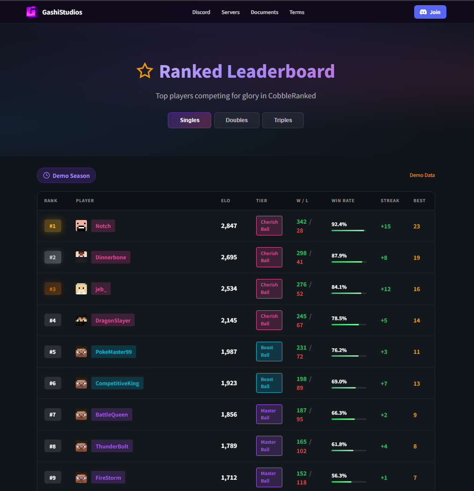
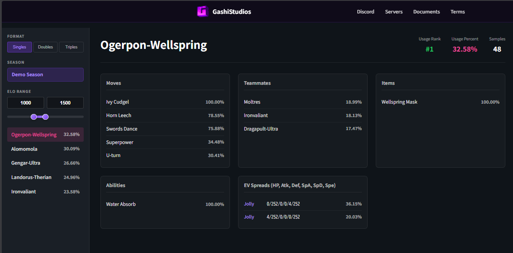

Build competitive Pokemon dashboards with CobbleRanked's HTTP API. Push ranked battle data to your web server in real-time.

> This page covers the developer-facing payload schemas and server implementation examples. For admin-facing setup, see [Web API Configuration](/docs/cobbleranked/configuration/api/).

## Features

- ✅ **Live Leaderboards** - Top players by ELO
- ✅ **Battle Replays** - Full Showdown protocol logs
- ✅ **Match Results** - Per-match history with team details and ELO changes
- ✅ **Usage Statistics** - Pokemon usage with win rates, banded by ELO tier
- ✅ **Configurable** - Toggle each data type and control sync frequency

---

## How It Works

CobbleRanked is an **HTTP client**, not a server. It pushes JSON `POST` requests to endpoints **you** define on your own web server. There is no port, host, or CORS to configure on the CobbleRanked side — your web server is what receives the data.

On cross-server setups, only the battle server pushes data (`crossServer.battleServerOnly: true` by default).

---

## Endpoints

CobbleRanked posts to these paths under your configured `endpoint.baseUrl`:

| Path (default) | Data | Trigger |
|----------------|------|---------|
| `/api/usage-stats` | Pokemon usage with win rates, banded by ELO tier | Periodic (`sync.intervalMinutes`, default 60m) |
| `/api/leaderboard` | Top N players by ELO per format | Periodic |
| `/api/battle-replay` | Full Showdown battle log + team species | After each ranked battle |
| `/api/match-result` | Per-match ELO change + full team composition | After each ranked battle |

Toggle each one with `sync.dataTypes.*` in `api.yaml`.

---

## Configuration

**File:** `config/cobbleranked/api.yaml`

```yaml
enabled: false

endpoint:
  baseUrl: "https://your-server.com"
  paths:
    pushUsageStats: "/api/usage-stats"
    pushLeaderboard: "/api/leaderboard"
    pushBattleReplay: "/api/battle-replay"
    pushMatchResult: "/api/match-result"

auth:
  apiKey: "your-secret-key"   # sent as the X-API-Key header
  headers: {}                 # extra headers, if your API needs them

sync:
  intervalMinutes: 60
  leaderboardLimit: 100       # max players per format (0 or negative = unlimited)
  dataTypes:
    usageStats: true
    leaderboard: true
    battleReplays: false
    matchResults: false
    eloTiers:                 # ELO buckets for usage stats
      - { minElo: 0 }
      - { minElo: 1300 }
      - { minElo: 1500 }
      - { minElo: 1700 }
  push:
    enabled: true
    batchIntervalSeconds: 30
    onlyIfChanged: true       # hash-based dedupe
  pull:
    enabled: false

http:
  timeoutSeconds: 30
  retryAttempts: 3
  retryDelaySeconds: 5

crossServer:
  battleServerOnly: true      # only the battle server pushes data
```

<details>
<summary><strong>Server Authentication</strong></summary>

CobbleRanked sends `X-API-Key` header with your configured key. Verify this on your server:

```javascript
const VALID_KEY = process.env.API_KEY;

app.use((req, res, next) => {
  const receivedKey = req.headers['x-api-key'];
  if (receivedKey !== VALID_KEY) {
    return res.status(401).json({ error: 'Unauthorized' });
  }
  next();
});
```

</details>

---

## Data Payloads

All payloads are JSON `POST` bodies. Field names are stable and match the Kotlin models in `ApiModels.kt`.

### Leaderboard

```json
{
  "serverId": "battle-server-1",
  "seasonName": "Season 1",
  "timestamp": "2026-01-02T12:00:00Z",
  "formats": {
    "SINGLES": {
      "format": "SINGLES",
      "players": [
        {
          "rank": 1,
          "uuid": "550e8400-...",
          "playerName": "ChampionPlayer",
          "elo": 2150,
          "tier": "CHERISH",
          "wins": 245,
          "losses": 32,
          "matches": 277,
          "winRate": 88.45,
          "currentStreak": 5,
          "bestStreak": 18
        }
      ]
    }
  }
}
```

### Match Result

Per-match data with ELO change and full team composition:

```json
{
  "matchId": "abc-123",
  "serverId": "battle-server-1",
  "seasonName": "Season 1",
  "format": "SINGLES",
  "matchType": "RANKED",
  "timestamp": "2026-01-02T12:00:00Z",
  "durationSeconds": 540,
  "endReason": "VICTORY",
  "players": [
    {
      "uuid": "550e8400-...",
      "playerName": "PlayerA",
      "eloBefore": 1500,
      "eloAfter": 1524,
      "eloChange": 24,
      "isWinner": true,
      "faintedCount": 1,
      "team": [
        {
          "species": "Garchomp",
          "ability": "Rough Skin",
          "item": "Choice Scarf",
          "moves": ["Earthquake", "Outrage", "Stone Edge", "Fire Fang"],
          "nature": "Jolly",
          "evSpread": "4/252/0/0/0/252"
        }
      ]
    }
  ]
}
```

### Battle Replay

Full Showdown protocol log pushed after each ranked battle ends:

```json
{
  "matchId": "abc-123",
  "serverId": "battle-server-1",
  "seasonName": "Season 1",
  "format": "SINGLES",
  "timestamp": "2026-01-02T12:00:00Z",
  "turnCount": 24,
  "endReason": "VICTORY",
  "players": [
    {
      "uuid": "550e8400-...",
      "playerName": "PlayerA",
      "team": ["Garchomp", "Rotom-Wash", "Togekiss"],
      "isWinner": true
    }
  ],
  "battleLog": [
    "|start|",
    "|switch|p1a: Garchomp|Garchomp, L100|100/100",
    "|turn|1"
  ]
}
```

### Usage Statistics

Pokemon usage with win rates, banded by the ELO tiers you configured:

```json
{
  "serverId": "battle-server-1",
  "seasonName": "Season 1",
  "timestamp": "2026-01-02T12:00:00Z",
  "formats": {
    "SINGLES": {
      "1500+": {
        "minElo": 1500,
        "maxElo": null,
        "totalBattles": 1250,
        "totalPokemon": 3750,
        "species": [
          {
            "name": "Garchomp",
            "usagePercent": 45.2,
            "count": 562,
            "winRate": 62.3,
            "abilities": { "Rough Skin": 85.3 },
            "items": { "Choice Scarf": 42.1 },
            "moves": { "Earthquake": 98.2 },
            "natures": { "Jolly": 70.1 },
            "evSpreads": { "4/252/0/0/0/252": 65.0 },
            "teammates": { "Rotom-Wash": 30.5 }
          }
        ]
      }
    }
  }
}
```

---

## ELO-Banded Aggregation

Usage statistics are **split by ELO band**, not pooled into one global average. You configure the band boundaries in `api.yaml`:

```yaml
sync:
  eloTiers:
    - { minElo: 0 }
    - { minElo: 1300 }
    - { minElo: 1500 }
    - { minElo: 1700 }
```

Each band becomes a key in the payload (e.g. `0+`, `1300+`, `1500+`, `1700+`) with its own `totalBattles` and per-species stats. If Garchomp sits at 45% usage overall but 70% in the `1700+` band, your dashboard can show that the high-ELO metagame leans heavily on it — useful for "meta by rating" views and counter-builder tools.

## Teammate Analysis

Every species entry carries a `teammates` map: for each Pokémon, how often each **other** species appears alongside it on the same team. Use it to surface popular cores and duos:

- `Garchomp → { Rotom-Wash: 30.5%, Togekiss: 18.2% }` → "Garchomp is most often paired with Rotom-Wash"
- Combine with `abilities`, `items`, `moves`, and `natures`/`evSpreads` to reconstruct common builds and suggest counters.

## Use Cases

| You want to build... | Use this data | How |
|----------------------|---------------|-----|
| **Live leaderboard widget** on your homepage | `/api/leaderboard` | Render top-N per format; refresh on the `sync.intervalMinutes` cadence |
| **Metagame / usage dashboard** | `/api/usage-stats` | Slice by ELO band to show "meta at my rating"; rank species by `usagePercent` and `winRate` |
| **Team builder / counter-picker** | `/api/usage-stats` (`abilities`, `items`, `moves`, `natures`, `evSpreads`, `teammates`) | Show the most common build for each species and its frequent partners; suggest counters by win-rate inversion |
| **Player profile / match history** | `/api/match-result` | List a player's recent matches with ELO before→after, team composition, and outcome |
| **Battle replay viewer** | `/api/battle-replay` | Feed the `battleLog` (Showdown protocol) into any Showdown replay renderer |

> 📝 All payloads are push-only (CobbleRanked → your server). For a player-profile view, store incoming `match-result` posts in your own database and query by `uuid`.

### Example output

A minimal community site consuming these endpoints — a rating/tier view and per-format win statistics, both rendered from `/api/leaderboard` and `/api/usage-stats`:




---

## Server Implementation

**Express.js Example:**

```javascript
const express = require('express');
const app = express();

app.use(express.json());

// Leaderboard endpoint
app.post('/api/leaderboard', (req, res) => {
  const { seasonName, formats } = req.body;
  console.log(`Leaderboard for ${seasonName}:`, Object.keys(formats));
  res.json({ success: true });
});

// Match result endpoint
app.post('/api/match-result', (req, res) => {
  const { players } = req.body;
  console.log(`Match result: ${players[0].playerName} vs ${players[1].playerName}`);
  res.json({ success: true });
});

// Battle replay endpoint
app.post('/api/battle-replay', (req, res) => {
  const { battleLog, turnCount } = req.body;
  console.log(`Replay: ${turnCount} turns, ${battleLog.length} log lines`);
  res.json({ success: true });
});

// Usage stats endpoint
app.post('/api/usage-stats', (req, res) => {
  const { formats } = req.body;
  console.log(`Usage stats received for ${Object.keys(formats).length} format(s)`);
  res.json({ success: true });
});

app.listen(3000);
```

<details>
<summary><strong>NestJS Example (TypeScript)</strong></summary>

```typescript
import { Controller, Post, Body } from '@nestjs/common';

class LeaderboardPayload {
  serverId: string;
  seasonName: string;
  formats: Record<string, {
    players: Array<{
      uuid: string;
      playerName: string;
      elo: number;
    }>;
  }>;
}

@Controller('api')
export class ApiController {
  @Post('leaderboard')
  async leaderboard(@Body() payload: LeaderboardPayload) {
    // Process leaderboard data
    return { success: true };
  }
}
```

</details>

---

## Testing

**Curl Commands:**

```bash
# Test leaderboard
curl -X POST https://your-server.com/api/leaderboard \
  -H "Content-Type: application/json" \
  -H "X-API-Key: your-secret-key" \
  -d '{"serverId":"test","seasonName":"Season 1","formats":{}}'

# Test match result
curl -X POST https://your-server.com/api/match-result \
  -H "Content-Type: application/json" \
  -H "X-API-Key: your-secret-key" \
  -d '{"matchId":"test","players":[]}'
```

You can also trigger a sync manually in-game: `/rankedadmin api sync` (push), `/rankedadmin api status` (state), `/rankedadmin api test` (config sanity check).

---

## Security

⚠️ **Production Requirements:**

- Use HTTPS only
- Validate `X-API-Key` header
- Rate limit requests (100 req/min recommended)
- Sanitize all input data
- Use read-only database accounts for queries

```sql
-- Create read-only database user (if your web app reads the CobbleRanked DB directly)
CREATE USER 'cobbleranked_web'@'%' IDENTIFIED BY 'secure_password';
GRANT SELECT ON cobbleranked.* TO 'cobbleranked_web'@'%';
```

---

## See Also

- [Web API Configuration](/docs/cobbleranked/configuration/api/) - Admin-facing setup and quick start
- [Database Configuration](/docs/cobbleranked/advanced/database/) - Direct database access
- [Placeholders](/docs/cobbleranked/integration/placeholders/) - In-game placeholders
- [Cross-Server Setup](/docs/cobbleranked/advanced/cross-server/) - Multi-server API sync
- [FAQ](/docs/cobbleranked/support/faq/) - Common API questions and troubleshooting
