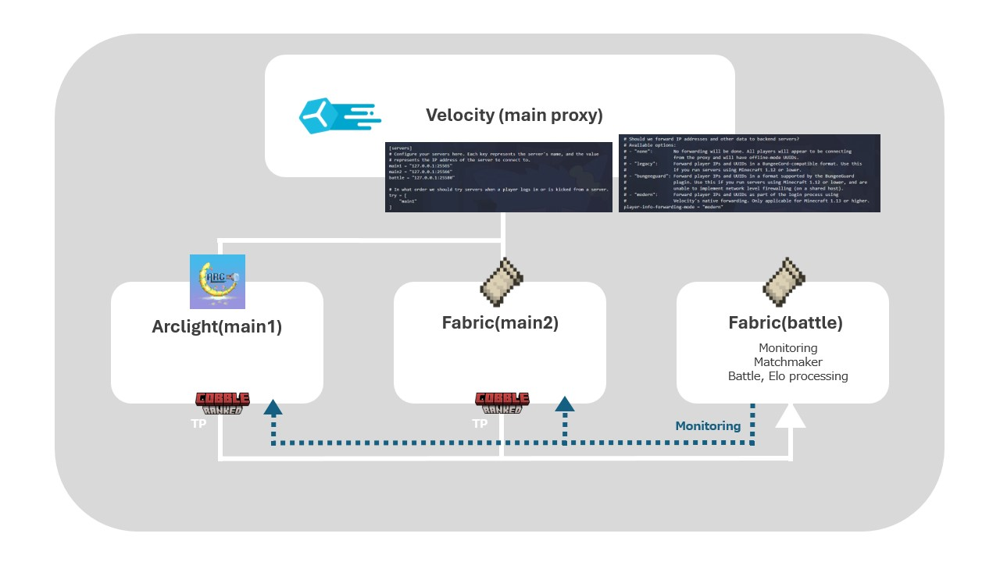

Share rankings and matchmaking queue across your entire network.

## How It Works

CobbleRanked uses a **lobby/battle server architecture**:

1. **Lobby Servers** - Players join the matchmaking queue from any server in your network
2. **Battle Server** - A dedicated server where all ranked battles take place
3. **Redis** - Synchronizes the queue across all servers in real-time
4. **Database** - Stores rankings, stats, and match history (shared by all servers)

When two players are matched, they are transferred to the battle server via Velocity, complete their battle, and return to their original servers.

> **Important: Pokemon Data Sync**
>
> CobbleRanked does **NOT** sync Cobblemon Pokemon data between servers. To ensure players have access to the same Pokemon across your network, configure Cobblemon's built-in MongoDB storage on **all servers**:
>
> ```hocon
> # config/cobblemon/main.conf
> storageFormat = "mongodb"
> mongoDBConnectionString = "mongodb://your-mongodb-host:27017"
> mongoDBDatabaseName = "cobblemon"
> ```
>
> All servers must point to the **same MongoDB instance** so Pokemon data is shared across your network.
>
> See [Cobblemon Config Wiki](https://wiki.cobblemon.com/index.php/Config) for more details.
>
> CobbleRanked only syncs: Rankings, Match History, Queue State, Season Data

---

## Requirements

| Component | Version | Purpose |
|-----------|---------|---------|
| MySQL | 8.0+ | Shared database (Option 1) |
| MongoDB | 6.0+ | Shared database (Option 2) |
| Redis | 6.0+ | Queue synchronization |
| Velocity | 3.4.0+ | Proxy server |
| [FabricProxy-Lite](https://modrinth.com/mod/fabricproxy-lite) | Latest | Required for PLUGIN_MESSAGE transfers |

> **Note:** As of v2.0.15, CobbleRanked supports two transfer methods. The default `PLUGIN_MESSAGE` method works with standard Velocity setups and doesn't require additional proxy plugins.

---

## Architecture



---

## Setup Steps

### 1. Install Redis

Redis handles real-time queue synchronization between servers.

**Linux (Ubuntu/Debian):**

```bash
sudo apt install redis-server
sudo systemctl start redis-server
sudo systemctl enable redis-server
```

**Docker:**

```bash
docker run -d -p 6379:6379 --name redis redis:latest
```

**Verify Installation:**

```bash
redis-cli PING
# Should return: PONG
```

### 2. Configure Database

All servers must connect to the same database. See [Database Configuration](/docs/cobbleranked/advanced/database/) for detailed MySQL/MongoDB setup.

### 3. Configure Battle Server

The battle server is where all ranked battles take place. Only one server should be configured as the battle server.

```yaml
# config.yaml on Battle Server
crossServer:
  enabled: true
  serverId: "battle"
  battleServer: ""  # Empty string = this IS the battle server

  # Transfer method for moving players between servers
  transferMethod: PLUGIN_MESSAGE  # or PROXY_COMMAND
  transferCommand: "server {server}"  # Only used with PROXY_COMMAND

  redis:
    host: "your-redis-host"
    port: 6379
    password: ""
    database: 0
    useSsl: false

  timing:
    matchFoundDelaySeconds: 5
    battleStartDelaySeconds: 10
    playerArrivalTimeoutSeconds: 30

database:
  type: "mysql"  # or "mongodb"

  mysql:
    host: "your-database-host"
    port: 3306
    database: "cobbleranked"
    username: "cobbleranked"
    password: "your_password"
    pool:
      maxSize: 10
      minIdle: 2
```

### 4. Configure Lobby Servers

Lobby servers handle queue joining. Players can join the queue from any lobby server.

```yaml
# config.yaml on Lobby Server
crossServer:
  enabled: true
  serverId: "lobby1"      # Must be unique for each lobby!
  battleServer: "battle"  # Name of the battle server in Velocity

  redis:
    host: "your-redis-host"  # Same as battle server
    port: 6379
    password: ""

database:
  type: "mysql"  # Same as battle server

  mysql:
    host: "your-database-host"  # Same as battle server
    port: 3306
    database: "cobbleranked"
    username: "cobbleranked"
    password: "your_password"
```

### 5. Configure Velocity

Add all servers to your `velocity.toml`:

```toml
[servers]
lobby1 = "127.0.0.1:25566"
lobby2 = "127.0.0.1:25567"
battle = "127.0.0.1:25568"

try = ["lobby1"]
```

> **Note:** The server names in Velocity must match the `serverId` and `battleServer` values in your CobbleRanked configs.

### 6. Configure Transfer Method

CobbleRanked supports two methods for transferring players between servers:

#### PLUGIN_MESSAGE (Recommended)

Uses the BungeeCord plugin messaging channel to transfer players directly. This is the default and recommended method.

**Requirements:**

- [FabricProxy-Lite](https://modrinth.com/mod/fabricproxy-lite) on all Fabric servers
- `bungeecord: true` in Velocity's `velocity.toml` (under `[advanced]`)

```yaml
# config.yaml
crossServer:
  transferMethod: PLUGIN_MESSAGE
```

**Advantages:**

- No additional proxy plugins needed
- Works with any Velocity setup
- Players don't need `/server` permission

#### PROXY_COMMAND (Alternative)

Uses [Proxy-Command-Reloaded](https://modrinth.com/plugin/proxy-command-reloaded) to execute transfer commands via Redis.

**Requirements:**

- [Proxy-Command-Reloaded](https://modrinth.com/plugin/proxy-command-reloaded) on Velocity
- Configure the command format

```yaml
# config.yaml
crossServer:
  transferMethod: PROXY_COMMAND
  transferCommand: "server {server}"  # Placeholders: {player}, {server}
```

**Use cases:**

- Custom transfer commands or workflows
- Networks with existing Proxy-Command-Reloaded setup
- Need to execute additional commands during transfer

---

## Server ID Reference

Each server needs a **unique** `serverId`. The `battleServer` field should be empty on the battle server itself, and set to the battle server's name on lobby servers.

| Server | serverId | battleServer |
|--------|----------|--------------|
| Battle Server | `battle` | `""` (empty) |
| Lobby 1 | `lobby1` | `"battle"` |
| Lobby 2 | `lobby2` | `"battle"` |

---

## Player Flow

1. Player opens `/ranked` on any lobby server
2. Player joins the matchmaking queue
3. Queue state syncs to all servers via Redis
4. Match found → Both players transfer to battle server
5. Battle completes → Results saved to shared database
6. Players return to their original lobby servers

---

## See Also

- [Database Configuration](database/) - MySQL/MongoDB setup details
- [Main Configuration](../configuration/config/) - General settings
- [FAQ](../support/faq/) - Common questions and troubleshooting
