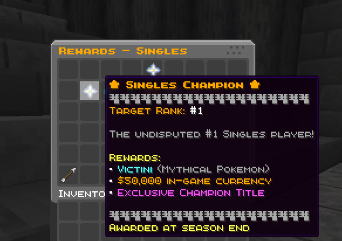

Configure rewards in `config/cobbleranked/rewards.yaml`. CobbleRanked supports three types of rewards:

- **Season Rewards** - End-of-season leaderboard rewards
- **Rank Rewards** - One-time rewards when reaching a new tier
- **Milestones** - Achievement-based rewards (wins, ELO thresholds)

## Season Rewards

Rewards given to top players when a season ends, based on their final leaderboard position.



```yaml
# rewards.yaml
seasonRewards:
  SINGLES:
    - id: "singles_champion"
      rankRange: "1"
      displayName: "&6&l★ Singles Champion ★"
      displayItem: "minecraft:nether_star"
      customModelData: 0
      lore:
        - "&7The undisputed #1 Singles player!"
        - ""
        - "&eRewards:"
        - "&f• &bVictini &7(Mythical Pokemon)"
        - "&f• &6$50,000 in-game currency"
      commands:
        - "pokegiveother {player} victini"
        - "eco give {player} 50000"
      mailSender: "&6Season Champion"
      mailTitle: "&6&l★ {format} Champion - Season {season} ★"
      mailMessage: "&eCongratulations! You are the #1 {format} player!"

    - id: "singles_elite"
      rankRange: "2-3"
      displayName: "&e&lSingles Elite"
      displayItem: "minecraft:diamond"
      lore:
        - "&7Top 3 Singles player!"
      commands:
        - "pokegiveother {player} victini"
        - "eco give {player} 25000"

    - id: "singles_top10"
      rankRange: "4-10"
      displayName: "&bSingles Expert"
      displayItem: "minecraft:gold_ingot"
      commands:
        - "eco give {player} 10000"
```

### Reward Fields

| Field | Required | Description |
|-------|----------|-------------|
| `id` | Yes | Unique identifier |
| `rankRange` | Yes | Rank(s) for this reward: `"1"`, `"2-3"`, `"11-25"` |
| `displayName` | Yes | Name shown in GUI (supports color codes) |
| `displayItem` | Yes | Item to display in reward GUI |
| `customModelData` | No | Custom model data for resource packs |
| `lore` | No | Description lines in GUI |
| `commands` | Yes | Commands to execute |
| `mailSender` | No | Sender name in mail |
| `mailTitle` | No | Mail subject line |
| `mailMessage` | No | Mail body text |

### Placeholders

| Placeholder | Description |
|-------------|-------------|
| `{player}` | Player username |
| `{uuid}` | Player UUID |
| `{rank}` | Final ranking position |
| `{tier}` | Player's rank tier |
| `{season}` | Season name |
| `{format}` | Battle format (SINGLES, DOUBLES, etc.) |

**Text Placeholder API Support:**

If Text Placeholder API is installed, reward commands also support general placeholders like:
- `%player_name%` - Player name
- `%player_uuid%` - Player UUID
- `%server_name%` - Server name
- And any placeholders registered by other mods

Example with both placeholder types:
```yaml
commands:
  - "eco give {player} 50000"              # CobbleRanked placeholder
  - "eco give %player_name% 50000"         # Placeholder API (equivalent)
  - "title %player_name% title "&6Reward!" # Placeholder API with formatting
```

## Rank Rewards

One-time rewards when a player reaches a new rank tier for the first time.

```yaml
# rewards.yaml
rankRewards:
  POKEBALL:
    tier: "POKEBALL"
    commands: []  # No reward for starting tier
    mailSender: "Rank Achievement"
    mailTitle: "Reached {tier} Rank!"
    mailMessage: "Congratulations on reaching {tier} rank in Season {season}!"

  GREATBALL:
    tier: "GREATBALL"
    commands:
      - "give {player} cobblemon:poke_ball 10"

  ULTRABALL:
    tier: "ULTRABALL"
    commands:
      - "give {player} cobblemon:great_ball 10"

  MASTERBALL:
    tier: "MASTERBALL"
    commands:
      - "give {player} cobblemon:ultra_ball 10"

  BEASTBALL:
    tier: "BEASTBALL"
    commands:
      - "give {player} cobblemon:master_ball 1"

  CHERISH:
    tier: "CHERISH"
    commands:
      - "give {player} cobblemon:master_ball 3"
```

### Reward Eligibility

Control whether rank rewards use **highest Elo achieved** or **current Elo** for eligibility:

```yaml
# rewards.yaml
rankRewardsUseHighestElo: true
```

| Setting | Default | Description |
|---------|---------|-------------|
| `rankRewardsUseHighestElo` | `true` | Use `true` to base eligibility on peak Elo, `false` for current Elo |

**How it works:**

- **When `true` (default)**: Players keep rewards based on their **highest Elo ever achieved**
  - Player reaches 1500 Elo → Gets ULTRABALL reward → Keeps ULTRABALL reward even if Elo drops to 1400
  - More lenient for players

- **When `false`**: Players only qualify for rewards based on their **current Elo**
  - Player reaches 1500 Elo → Gets ULTRABALL reward → Elo drops to 1400 → Can no longer claim higher tier rewards
  - More competitive; rewards must be "re-earned" after rating loss

> 📝 This affects **reward eligibility only**. Players keep any rewards they've already claimed.

## Milestones

Achievement rewards based on wins, ELO reached, or win streaks. Tracked per-format.

```yaml
# rewards.yaml
milestones:
  SINGLES:
    # Win count milestones
    - id: "singles_5_wins"
      type: "WINS"
      requirement: 5
      displayName: "&7First Steps"
      displayItem: "minecraft:wooden_sword"
      lore:
        - "&7Win 5 ranked singles matches"
        - ""
        - "&eReward: &61 Rare Candy"
      commands:
        - "give {player} cobblemon:rare_candy 1"

    - id: "singles_50_wins"
      type: "WINS"
      requirement: 50
      displayName: "&9Singles Veteran"
      displayItem: "minecraft:golden_sword"
      commands:
        - "give {player} cobblemon:rare_candy 5"
        - "eco give {player} 2500"

    # ELO milestones
    - id: "singles_1500_elo"
      type: "ELO"
      requirement: 1500
      displayName: "&bPlatinum Tier"
      displayItem: "minecraft:diamond"
      commands:
        - "pokegiveother {player} random"
        - "eco give {player} 3000"

    - id: "singles_2000_elo"
      type: "ELO"
      requirement: 2000
      displayName: "&6&l★ Grandmaster ★"
      displayItem: "minecraft:nether_star"
      commands:
        - "pokegiveother {player} celebi"
        - "eco give {player} 25000"
```

### Milestone Types

| Type | Description |
|------|-------------|
| `WINS` | Total wins in this format |
| `MATCHES` | Total matches played |
| `ELO` | Reach a specific ELO rating |
| `WIN_STREAK` | Achieve a win streak |

## Reward Delivery

Rewards are delivered via **MailLib** (required). Players claim them with `/mailbox`. Offline players receive rewards on next login.

## Per-Format Rewards

Each format (SINGLES, DOUBLES, TRIPLES) has separate rankings and reward tiers. Configure under `seasonRewards:` using the format name as key.

## See Also

- [Seasons](/docs/cobbleranked/features/seasons/) - Season mechanics
- [ELO System](/docs/cobbleranked/features/elo-system/) - Rank tiers
- [GUI Customization](/docs/cobbleranked/configuration/gui/) - Reward GUI layout
- [FAQ](/docs/cobbleranked/support/faq/) - Common questions and troubleshooting
