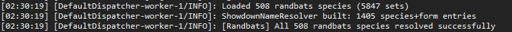

## What is Random Battle?

**Random Battle** (Randbats) is a Pokémon Showdown-style mode where you don't bring your own team. The server generates a balanced, level-adjusted team for you every match. Just queue up and play.

- **No team prep.** A fresh server-generated team every match.
- **508 species**, with moves, abilities, items, levels, and Tera types drawn from the official [Showdown randbats data](https://github.com/pkmn/randbats) (`gen9randombattle.json`).
- **Playable in BOTH Casual and Ranked.** Random Battle has its own **separate rating and leaderboard**, fully isolated from regular Singles/Doubles/Triples. Climbing the randbats ladder never touches your normal rank.
- **Singles, Doubles, and Triples** are all available (`RANDOM_SINGLES`, `RANDOM_DOUBLES`, `RANDOM_TRIPLES`).

Adaptation is the whole game. You never know exactly what you'll face, so reading the team sheet and planning on the fly is everything.



---

## How Teams Are Generated

Each player is given a **6-Pokémon team**. For every species, a set is picked from the bundled randbats data: a fixed level, ability, item, four moves, and a Tera type.

- **Uneven levels.** Stronger species come in at lower levels and weaker ones higher, so matches stay balanced even with very different base stat totals.
- **Random Poké Ball.** Each Pokémon is held in a random ball variety (cosmetic only).
- **No duplicate species** by default (Species Clause), and team composition is constrained for fairness — see below.

### Stat Modes (`statsMode`)

How IVs/EVs/nature are assigned to each generated Pokémon. Configured in [`battle.yaml`](/docs/cobbleranked/configuration/battle/#random-battle-randbats).

| Mode | IVs | EVs | Nature | Notes |
|------|-----|-----|--------|-------|
| `OFFICIAL` (default) | 31 | 85 in every stat | neutral | Showdown Random Battle parity. Sets with no physical moves drop Attack EV/IV to 0; Trick Room / Gyro Ball sets drop Speed EV/IV to 0. |
| `OPTIMIZED` | 31 | HP 252 + attack stat 252 + others 4 | adamant / modest | Every Pokémon tuned to hit hard. Not official randbats behavior, but competitively tuned teams. |
| `FLAT` | 31 | 0 | neutral | Minimal. Equivalent to the old `optimizeStats: false`. |

> `OFFICIAL` is the closest to a real Showdown Random Battle. Use `OPTIMIZED` if you want every Pokémon to feel tuned.

The legacy `optimizeStats` flag is still respected for backward compatibility: when `statsMode` is `OPTIMIZED`, `optimizeStats: false` is treated as `FLAT`. Setting `statsMode` explicitly always takes precedence.

---

## Team Composition Constraints (`weighting`)

By default, team composition is constrained for variety and fairness (matching Showdown). These live under `battle.yaml -> randomBattle.weighting` and can be tuned or disabled:

```yaml
# battle.yaml
randomBattle:
  weighting:
    enabled: true
    multipliers: {}               # speciesId -> weight multiplier (boost/reduce appearance rate)
    exclusions: []                # speciesId list to exclude entirely
    speciesDuplication:
      enabled: true
      maxSameBaseSpecies: 1       # max team members sharing an evolution line
    typeDiversity:
      enabled: true
      maxPerType: 2               # max team members sharing each elemental type
    resistanceDiversity:
      enabled: true
      maxWeaknesses: 3            # max shared single weaknesses
      maxDoubleWeaknesses: 1      # max shared 4x weaknesses
```

- **Species duplication**: caps how many team members can share an evolution root.
- **Type diversity**: caps how many team members may share each elemental type (default max 2).
- **Resistance diversity**: caps shared weaknesses across the team (default max 3 single, max 1 double).
- **Custom weighting**: `multipliers` to boost/reduce specific species, `exclusions` to remove species from the pool.

If the constraints are too tight to fill a team, type and resistance rules relax automatically as a fallback.

---

## Per-Season Pools

Random Battle can be enabled/disabled **per format, per season** in your season preset, and you can also whitelist or blacklist species per format:

```yaml
# season_presets/default.yml
randomSingles:
  enabled: true                   # false = hide Random Singles this season
  sleepClause: true
  limitedSpecies: []              # whitelist: only these species appear (empty = all)
  excludedSpecies: []             # blacklist: these species never appear

randomDoubles:
  enabled: true
  sleepClause: true
  limitedSpecies: []
  excludedSpecies: []

randomTriples:
  enabled: true
  sleepClause: true
  limitedSpecies: []
  excludedSpecies: []
```

This is in addition to the global `weighting.exclusions` in `battle.yaml`. Use `limitedSpecies` to run a themed season (e.g. Kanto-only randbats), or `excludedSpecies` to remove problem Pokémon.

---

## Auto-Update

Optionally, the server can periodically fetch the latest randbats data from `data.pkmn.cc` and hot-reload it. **Disabled by default.**

```yaml
# battle.yaml
randomBattle:
  autoUpdate:
    enabled: false
    intervalHours: 24
    sourceUrl: "https://data.pkmn.cc/randbats"
    battleServerOnly: true        # cross-server: only the battle server fetches (lobbies don't generate teams)
    backupDir: "randbats"         # previous data is backed up here before each update
```

On cross-server setups, only the battle server fetches — lobby servers don't generate teams, so they skip the update.

---

## Rating and Leaderboard

Random Battle formats are **isolated** from regular formats:

- Each `RANDOM_*` format has its own rating, using the same rating system as normal ([Pokémon Showdown or Glicko-2](/docs/cobbleranked/features/elo-system/)).
- Each has its own **leaderboard**, separate from regular Singles/Doubles/Triples.
- Matchmaking is skill-based, same as regular ranked — you're matched by your Random Battle rating.
- Your randbats rank has no effect on your normal rank, and vice versa.

---

## Casual vs Ranked

Both queues are available:

- **Casual** (`/casual` → Random button): rating doesn't change. Good for learning the format.
- **Ranked** (`/ranked` → Random button): rating changes, climbs the Random leaderboard, and counts toward season milestones/season-end rewards for that format.

Random Battle must be enabled in the active season preset for the **ranked** variant to show; the casual variant is available whenever `randomBattle.enabled` is true.

---

## Enabling Random Battle

Two switches control availability:

1. **Global toggle** in [`battle.yaml`](/docs/cobbleranked/configuration/battle/#random-battle-randbats):

```yaml
# battle.yaml
randomBattle:
  enabled: true
  teamSize: 6
  setsFile: "gen9randombattle.json"
  statsMode: "OFFICIAL"
```

2. **Per-format toggle** in the active [season preset](/docs/cobbleranked/features/battle-formats/) (`randomSingles` / `randomDoubles` / `randomTriples`).

When both are on, the Casual and Ranked GUIs show the `RANDOM_*` format buttons.

---

## GUI Customization

The Random Battle buttons in the Ranked and Casual menus are fully customizable — icon, slot, model data, and display name. See [`ranked_gui.yaml` / `casual_gui.yaml`](/docs/cobbleranked/configuration/gui/#ranked-gui):

```yaml
# gui/ranked_gui.yaml
format_buttons:
  random_singles:
    slot: 30
    material: "cobblemon:verdant_ball"
    custom_model_data: 0
    displayname: "ranked_gui_format_title"
  random_doubles:
    slot: 32
    material: "cobblemon:azure_ball"
    custom_model_data: 0
    displayname: "ranked_gui_format_title"
  random_triples:
    slot: 34
    material: "cobblemon:premier_ball"
    custom_model_data: 0
    displayname: "ranked_gui_format_title"
```

---

**Related**: [Battle Formats](/docs/cobbleranked/features/battle-formats/) | [Battle Configuration](/docs/cobbleranked/configuration/battle/) | [ELO System](/docs/cobbleranked/features/elo-system/)
