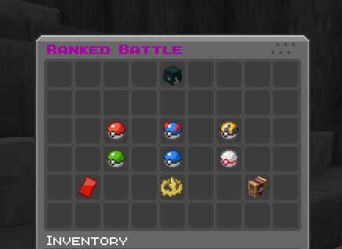

## Start in 3 minutes

If you haven't installed yet, finish [Installation](/docs/cobbleranked/getting-started/installation/) first. This page picks up once the mod is on the server.

---

### Step 1. Start the server

Drop the mods into `mods/` and boot up. Config files generate on their own, and **the defaults are ready to play right away**.

### Step 2. Set up one arena

You need at least one arena. Stand where each player should be and register it:

```
/rankedadmin arena create arena1 pos1     # player 1's spot
/rankedadmin arena create arena1 pos2     # player 2's spot
/rankedadmin arena create arena1 exit     # where to send players after the battle
```

> Full details in [Arena Setup](/docs/cobbleranked/configuration/arenas/).

### Step 3. Open the menu

In chat, type:

```
/ranked
```

The ranked menu opens with the player's rating, the leaderboard, and a **Join Queue** button.



### Step 4. Join the queue

Click **Join Queue** for the format you want (Singles, Doubles, or Triples). The server looks for an opponent at a similar rating.

### Step 5. Match, then battle

A "Match Found!" prompt appears when someone's found. Click **Ready**, get teleported to the arena, and the battle starts.

```
Join Queue → Match → Ready check → Team selection → Lead selection → Battle → Results
```


Win to climb, lose to drop. That's the whole loop.

---

## Commands you'll use

| Command | What it does |
|---------|--------------|
| `/ranked` | Opens the ranked menu (rating, leaderboard, queue) |
| `/casual` | Opens the casual menu (practice, rating doesn't move) |

## Just want to practice?

`/casual` runs the same flow without touching rating. Good for warming up or trying a new team.

---

## Next steps

- **[Ranked Battles](/docs/cobbleranked/features/ranked-battles/)**: how a match flows and the rules behind it.
- **[Random Battle](/docs/cobbleranked/features/random-battle/)**: a no-prep mode with its own ladder.
- **[FAQ](/docs/cobbleranked/support/faq/)**: search here if something's unclear.
