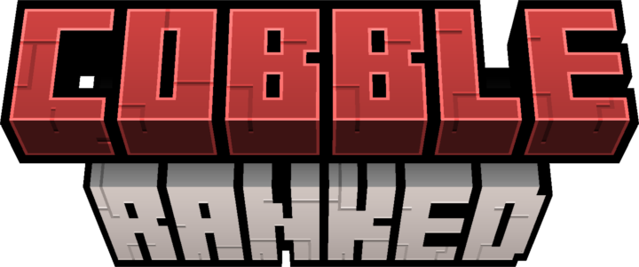
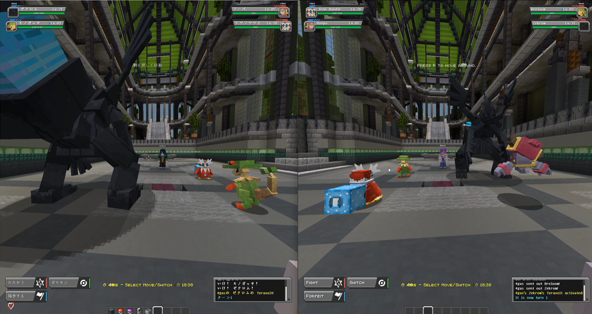

**A full competitive ranked battle system for Cobblemon servers — server-side only, no client mod required.**

Drop it in, and your players queue, get matched at their skill level, battle, and climb the ladder. Seasons, rewards, leaderboards, cross-server syncing, and a Showdown-style Random Battle mode are all built in.

- ELO and optional Glicko-2 ratings that track real skill
- Seasons on a fixed schedule with automatic rewards
- Auto-matchmaking against players near your rating
- One rating shared across every linked server
- Flee / forfeit protection to keep ranked fair

---

Why CobbleRanked

## Built for public servers

Most ranked mods force every player to install a client mod. CobbleRanked runs **entirely server-side**. That design choice is what makes it the standard on successful Cobblemon servers — and it drives three concrete advantages.

<i class="ph ph-plug"></i>

### Zero client install

Players join with a vanilla client and type `/ranked`. No mod downloads, no version mismatches, no players bouncing at the door. Lower friction means better retention for public servers.

<i class="ph ph-palette"></i>

### Fully themed GUIs

Every menu is a customizable chest GUI delivered via resource pack, so it matches your server's identity. Players never manually install anything — the look just loads when they join.

<i class="ph ph-shield-check"></i>

### Secure by design

All ranked logic lives on the server. The internal implementation never reaches the client, which is what keeps cheat mods from reading matchmaking, rating, or battle state. This is the only safe way to run ranked.

<i class="ph ph-stack"></i>

### Everything in one box

Random Battle, seasons, milestones, reward delivery, leaderboards, placeholders, cross-server sync, and anti-rage-quit penalties — plus everything simpler ranked mods do, in a single mod.

---

What players get

## A complete competitive loop

<i class="ph ph-trophy"></i>

### Ranked Battles

The server finds an opponent around your skill level. Win to climb, lose to drop. Team selection, lead selection with held-item reveals, per-turn and per-match timers — the full competitive package.

<i class="ph ph-dice-five"></i>

### Random Battle

A Pokémon Showdown-style mode where the server builds a balanced 6-Pokémon team for you. No team prep; just queue and play. It runs on its own rating and leaderboard, separate from regular ranked.

<i class="ph ph-calendar-blank"></i>

### Seasons and Rewards

Each season runs on a fixed schedule. When it ends, top players and anyone who hit a rank or win milestone get rewards automatically through the in-game mailbox.

<i class="ph ph-globe-hemisphere-west"></i>

### Cross-Server

Link your servers together and ratings, queues, and leaderboards are shared across all of them. Players can queue from anywhere on your network.

---

Compare

## How it compares

Free ranked mods exist for Cobblemon, and they're solid projects. Here's an honest look at where CobbleRanked goes further:

| | **CobbleRanked** | [Cobblemon Ranked](https://modrinth.com/mod/cobblemon-ranked) | [Cobblemon Rankeds](https://modrinth.com/mod/cobblemon-rankeds) |
|---|---|---|---|
| Price | $10 | Free | Free |
| Fully server-side | ✅ | ⚠️ Team preview needs a client mod | ✅ |
| Rating system | Showdown ELO **+ Glicko-2** | ELO | ELO |
| Formats | Singles, Doubles, Triples | Singles, Doubles, 2v2 Singles | Singles, Doubles, 2v2 |
| Random Battle (Showdown-style) | ✅ Own rating & leaderboard | ❌ | ❌ |
| Seasons & automatic rewards | ✅ In-game mailbox delivery | ✅ Command rewards | ✅ Command rewards |
| Cross-server sync | ✅ Shared ratings, queues & leaderboards | ⚠️ Singles only, no longer maintained | ❌ |
| Web API & live web leaderboard | ✅ | ❌ | ❌ |
| Placeholder support | ✅ | ✅ | ❌ |
| Missions & milestones | ✅ | ❌ | ❌ |
| Themed GUIs via resource pack | ✅ | ❌ Chest GUI | ❌ Chest GUI |

📝 Comparison based on each mod's public Modrinth listing as of July 2026. If you just need basic ranked battles, the free mods are a fine place to start — CobbleRanked is built for servers that want the full competitive package.

---

See it live

## Try the live demo

The Web API isn't a promise on a feature list — it's running right now. These pages are powered by a real CobbleRanked server:

  <a class="cta-button" href="/demo/leaderboard"><i class="ph ph-ranking"></i> Live Leaderboard</a>
  <a class="cta-button" href="/demo/usage-stats"><i class="ph ph-chart-bar"></i> Pokémon Usage Stats</a>

Build your own site or Discord bot on the same data — see the [Web API docs](/docs/cobbleranked/configuration/api/).

---

Get started

## Live in 3 minutes

Install, start the server, type `/ranked`. The shortest path to a first battle is in the [Quick Start](/docs/cobbleranked/getting-started/quick-start/).

  <a class="cta-button primary" href="/docs/cobbleranked/getting-started/quick-start/"><i class="ph ph-play"></i> Quick Start</a>
  <a class="cta-button" href="/docs/cobbleranked/getting-started/installation/"><i class="ph ph-download-simple"></i> Installation</a>
  <a class="cta-button" href="https://voxel.shop/product/8733/cobbleranked"><i class="ph ph-shopping-cart"></i> Buy on VoxelShop</a>

---

## For server admins

Start with the defaults and tune later. Out of the box, it's ready to play.

1. **[Installation](/docs/cobbleranked/getting-started/installation/)** — drop the mods in and boot the server.
2. **[Arena setup](/docs/cobbleranked/configuration/arenas/)** — pick where battles happen.
3. **[Rewards](/docs/cobbleranked/configuration/rewards/)** — decide what players earn at season end.
4. **[Cross-server](/docs/cobbleranked/advanced/cross-server/)** — link multiple servers (optional).

Everything else lives under **Reference** and **Configuration** in the sidebar. Open them when you want to tweak something.

---

## Need help?

The [FAQ](/docs/cobbleranked/support/faq/) covers the questions buyers ask most, and it's searchable. If you're still stuck, join us in [Discord](https://discord.gg/VVVvBTqqyP).

**Available on [VoxelShop](https://voxel.shop/product/8733/cobbleranked)**
