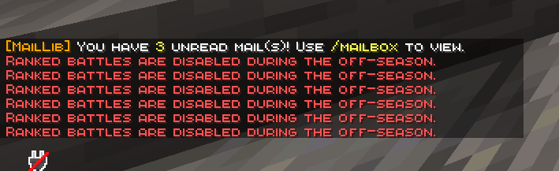

The most common questions from buyers, all in one place. **Press Ctrl+F (⌘+F on Mac) to search.**

## 💡 Basics

<details>
<summary><strong>Do players need to install the mod on their client?</strong></summary>

**No.** CobbleRanked runs entirely server-side. Players join with a vanilla client and just type `/ranked`. Nothing to install.

</details>

<details>
<summary><strong>Is Cobblemon required?</strong></summary>

Yes. CobbleRanked is built on top of Cobblemon's battle system. You also need **GashiLibs** and **MailLib** (for reward delivery). See [Installation](/docs/cobbleranked/getting-started/installation/).

</details>

<details>
<summary><strong>Can I use it in Japanese?</strong></summary>

Yes. Set `language: ja-jp` in `config.yaml` and run `/rankedadmin reload`. The GUI and messages switch to Japanese. English (`en-us`) and Japanese (`ja-jp`) ship with the mod; any other language can be added as a custom file.

</details>

<details>
<summary><strong>Does it work on Arclight / BungeeCord / Velocity?</strong></summary>

- **Velocity / BungeeCord**: supported for cross-server setups (used to transfer players between servers).
- **Arclight** (Forge/Bukkit hybrid): compatible, with some timing adjustments built in. If anything misbehaves, let us know in [Discord](https://discord.gg/VVVvBTqqyP).

</details>

## ⚔️ Battles & Matchmaking

<details>
<summary><strong>The team selection screen (Team Preview) doesn't appear</strong></summary>

That's expected. In **Random Battle**, or any format where you battle with a full party of 6, team selection is skipped and the match starts straight at lead selection. In normal ranked (picking a few from your party) it does appear.

</details>

<details>
<summary><strong>No matches, can't find an opponent</strong></summary>

- Make sure at least one arena is enabled (`/rankedadmin arena status`).
- You need at least two players in the queue for a match to form.
- A large rating gap makes matches take longer. The search range expands slowly over time.
- See [Matchmaking settings](/docs/cobbleranked/configuration/matchmaking/) for details.

</details>

<details>
<summary><strong>Players don't return to where they were after a battle</strong></summary>

Check that the arena's `exit` (return point) is set. Configure it with `/rankedadmin arena create <name> exit`.

</details>

<details>
<summary><strong>Someone is feeding rating to an alt on purpose (ELO farming)</strong></summary>

Handled. Forfeits and mid-battle disconnects carry escalating penalties, and **early forfeits right after the match starts can carry an extra-heavy penalty**. You can also optionally forbid forfeiting during the first few turns. See [Flee & Forfeit Penalties](/docs/cobbleranked/features/forfeit-system/).

</details>

<details>
<summary><strong>I can't queue for ranked during the off-season</strong></summary>

That's by design. While no season is running, ranked queue entry is blocked (casual battles stay open). Once a new season starts, ranked opens again.



</details>

## 📈 Rating & Ranks

<details>
<summary><strong>What are the rank tiers?</strong></summary>

Six tiers, named after Poké Balls, climbed in order:

| Tier | Rating (Pokémon Showdown mode) |
|------|------|
| Poké Ball | 0+ |
| Great Ball | 1200+ |
| Ultra Ball | 1400+ |
| Master Ball | 1600+ |
| Beast Ball | 1800+ |
| Cherish Ball | 2000+ |

> In Glicko-2 mode, separate thresholds centered on 1500 are applied automatically.

</details>

<details>
<summary><strong>I'm worried newcomers will tank their rating and get stuck</strong></summary>

They won't. At low ratings the system is asymmetric: you gain more on a win than you lose on a loss (matching Pokémon Showdown). Newcomers climb steadily instead of spiraling.

</details>

<details>
<summary><strong>My rating didn't change after a battle</strong></summary>

Common causes:

- It was a casual battle (`/casual`); rating doesn't move there.
- You hit the daily rating-gain cap. Losses are never capped.
- The match didn't finish cleanly (disconnect, etc.).

</details>

<details>
<summary><strong>I want to reset ratings</strong></summary>

For one player: `/rankedadmin setelo <player> <format> <elo>`. For everyone at once (new-season reset), use `onSeasonEnd` in [Season settings](/docs/cobbleranked/configuration/season/) and pick a hard reset or a partial (soft) reset.

</details>

## 🎁 Rewards & Seasons

<details>
<summary><strong>Season-end rewards aren't delivered</strong></summary>

- Make sure **MailLib** is installed. Rewards go out through the mailbox.
- Check that reward commands are set in `rewards.yaml` or your season preset.
- Players claim with `/mailbox`. Rewards for offline players land on their next login.

</details>

<details>
<summary><strong>How do players claim rewards?</strong></summary>

```
/mailbox
```

Open the mailbox and claim.

</details>

<details>
<summary><strong>The season doesn't end automatically</strong></summary>

- Check the end date/time and **timezone** in `season.yaml` (IANA format, e.g. `Asia/Tokyo`).
- Rotate manually with `/rankedadmin season rotate`.
- If the server was offline when the season changed, it's detected and applied on the next startup.

</details>

## ⚙️ Configuration & Operation

<details>
<summary><strong>I edited a config but it's not applied</strong></summary>

Run `/rankedadmin reload`. On cross-server setups, every server needs a reload or restart.

</details>

<details>
<summary><strong>"This team is invalid for this format"</strong></summary>

The team tripped a blacklist (banned Pokémon/moves/items), a label limit (e.g. max 1 Legendary), or a duplicate rule (no duplicate species or held items). See [Blacklist configuration](/docs/cobbleranked/configuration/blacklist/).

</details>

<details>
<summary><strong>I want to lock a specific player out of ranked</strong></summary>

`/rankedadmin banranked <player>` bans them from ranked (requires LuckPerms; casual still allowed). Lift it with `/rankedadmin unbanranked <player>`.

</details>

<details>
<summary><strong>I want to clear a player's disconnect penalty</strong></summary>

```
/rankedadmin clearpenalty <player>
```

</details>

<details>
<summary><strong>Can I use other languages like Portuguese or Chinese?</strong></summary>

Yes. Add a language file under `config/cobbleranked/language/` and set `language` to match. Any language works. See [Languages](/docs/cobbleranked/configuration/languages/).

</details>

## 🌐 Cross-Server

<details>
<summary><strong>What do I need for cross-server?</strong></summary>

- A shared database (**MySQL** or **MongoDB**; SQLite is single-server only).
- **Redis** for queue sync.
- A proxy (Velocity or BungeeCord) for player transfers.

Steps are in [Cross-Server Setup](/docs/cobbleranked/advanced/cross-server/).

</details>

<details>
<summary><strong>Redis won't connect</strong></summary>

- Is Redis running? (`redis-cli ping` should return `PONG`.)
- Are the host, port, and password in `config.yaml` correct?
- Is port 6379 open in your firewall?

</details>

<details>
<summary><strong>Ratings aren't shared across servers</strong></summary>

Make sure every server points at the **same database**. SQLite is per-server, so it can't back a cross-server setup.

</details>

## 🆘 Still stuck?

1. Check `logs/latest.log` for errors.
2. Have the relevant config files ready.
3. Ask in [Discord](https://discord.gg/VVVvBTqqyP) under #feedback.
